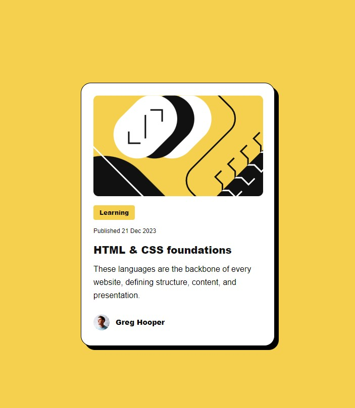
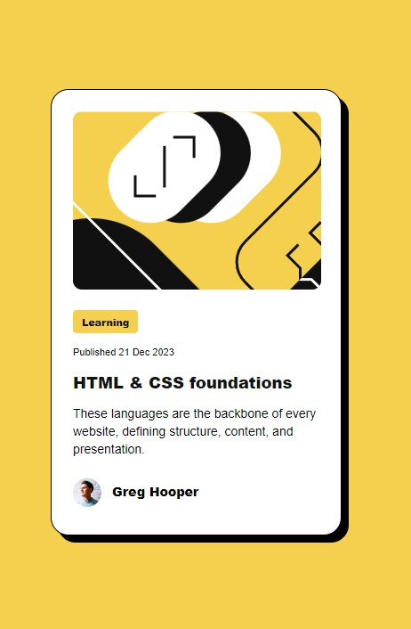

# Frontend Mentor - Blog preview card solution

This is a solution to the [Blog preview card challenge on Frontend Mentor](https://www.frontendmentor.io/challenges/blog-preview-card-ckPaj01IcS). Frontend Mentor challenges help you improve your coding skills by building realistic projects. 

## Table of contents

- [Overview](#overview)
  - [The challenge](#the-challenge)
  - [Screenshot](#screenshot)
  - [Links](#links)
- [My process](#my-process)
  - [Built with](#built-with)
  - [What I learned](#what-i-learned)
  - [Continued development](#continued-development)
  - [Useful resources](#useful-resources)
- [Author](#author)
- [Acknowledgments](#acknowledgments)

**Note: Delete this note and update the table of contents based on what sections you keep.**

## Overview

### The challenge

Users should be able to:

- See hover and focus states for all interactive elements on the page

### Screenshot




### Links

- Solution URL: [Add solution URL here](https://your-solution-url.com)
- Live Site URL: [Add live site URL here](https://your-live-site-url.com)

## My process

### Built with

- Semantic HTML5 markup
- CSS custom properties
- Flexbox
- CSS Grid
- Mobile-first workflow

### What I learned

During this challenge I learned how to use an .svg file as a background image for my project.

I was able to use :focus as well, and discover the tabindex property.

I was really exited to use nested CSS styling.


```css
.card:hover {
    box-shadow: 16px 16px 0px 0px rgba(0,0,0,1);
    & h1 {
        color: var(--hover-highlight-color);
        transition: ease-in-out 0.3s;
    }
    transition: ease-in-out 0.3s;
}

.card:focus {
    box-shadow: 16px 16px 0px 0px rgba(0,0,0,1);
    transition: ease-in-out 0.3s;
    & h1 {
        color: var(--hover-highlight-color);
        transition: ease-in-out 0.3s;
    }
}
```

### Continued development

I want to continue focusing on learning new ways on how to  design components using CSS, HTML, with the addition of JavaScript.

### Useful resources

- [W3 Schools](https://www.w3schools.com/) - This webside helped me to figured out how to use :focus and tabindex.

## Author

- Frontend Mentor - [@cacesasa](https://www.frontendmentor.io/cacesasa/yourusername)
- Twitter - [@cacesasa](https://www.twitter.com/cacesasa)


